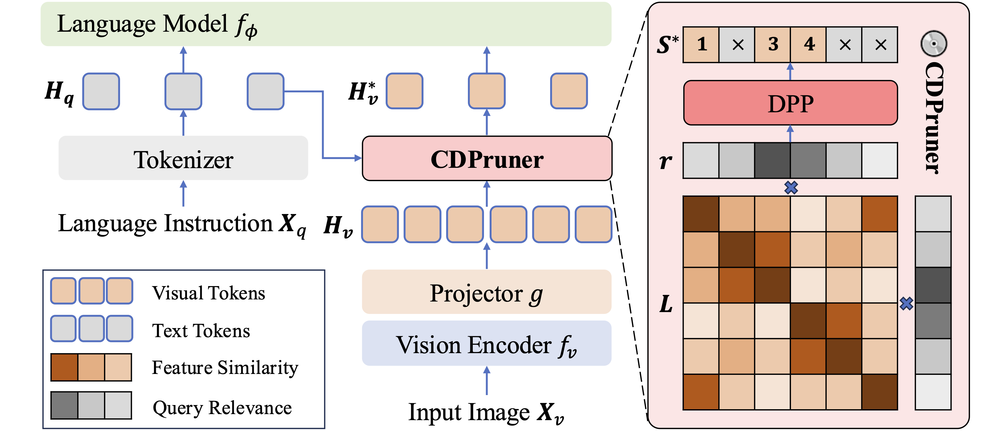

# 💿 Beyond Attention or Similarity: Maximizing Conditional Diversity for Token Pruning in MLLMs

*A training-free and model-agnostic visual token pruning method for MLLM inference acceleration by maximizing the conditional diversity of retained tokens.*

[📄 [Paper](https://arxiv.org/submit/6537250)] [🎞️ [Project Page](https://theia4869.com/CDPruner)]

## 👁️ Overview

Abundant efforts have been made to reduce the inference cost of MLLMs by pruning visual tokens, and existing methods can be roughly divided into two categories. The first is to identify visual tokens with high attention scores as important and discard those deemed less critical, which only considers the importance of visual tokens, resulting in **a large number of duplicate tokens** being retained. The second is to remove redundant parts based on feature similarity between visual tokens, which neglects user instructions, **failing to achieve dynamic pruning** in alignment with the current question. CDPruner considers the conditional diversity of the selected subset, dynamically adjusting pruning according to the user instructions and retaining maximal visual information.


CDPruner first calculates the similarity between visual tokens conditioned on their relevance to the current instruction. Then, CDPruner uses a DPP to select the subset to keep. As a training-free and model-agnostic method, it ensures **both the diversity and quality** of the selected token subset, significantly reducing computational cost while maintaining considerable performance.




## ⚙️ Setup

### 🏝️ Environment

1. Clone this repository.
```bash
git clone https://github.com/Theia-4869/CDPruner.git
cd CDPruner
```

2. Install necessary packages.
```bash
conda create -n cdpruner python=3.10 -y
conda activate cdpruner
pip install -e .
```

3. (Optional) Install FlashAttention for further inference acceleration.
```bash
pip install flash-attn --no-build-isolation
```

### 📦️ Model

Download corresponding [LLaVA](https://github.com/haotian-liu/LLaVA/blob/main/docs/MODEL_ZOO.md) checkpoints from [Hugging Face](https://huggingface.co/liuhaotian) 🤗:

| Version | LLM | Checkpoint |
|----------|:----------:|:-----------:|
| LLaVA-1.5 | Vicuna-7B | [liuhaotian/llava-v1.5-7b](https://huggingface.co/liuhaotian/llava-v1.5-7b) |
| LLaVA-1.5 | Vicuna-13B | [liuhaotian/llava-v1.5-13b](https://huggingface.co/liuhaotian/llava-v1.5-13b) |
| LLaVA-1.6 (LLaVA-NeXT) | Vicuna-7B | [liuhaotian/llava-v1.6-vicuna-7b](https://huggingface.co/liuhaotian/llava-v1.6-vicuna-7b) |
| LLaVA-1.6 (LLaVA-NeXT) | Vicuna-13B | [liuhaotian/llava-v1.6-vicuna-13b](https://huggingface.co/liuhaotian/llava-v1.6-vicuna-13b) |

### 📊 Data

Download each dataset according to [EVAL.md](EVAL.md).

## 📋️ Evaluation

The main implementation of CDPruner is highlighted with `CDPruner` annotations, mainly in [`llava_llama.py`](llava/model/language_model/llava_llama.py#L51), [`llava_arch.py`](llava/model/llava_arch.py#L140) and [`clip_encoder.py`](llava/model/multimodal_encoder/clip_encoder.py#L42).

We provide the evaluation scripts for each benchmark, you only need to set the remaining visual token number as the bash argument. For example, if you want to evaluate CDPruner with 128 visual tokens retained on the GQA benchmark, you can run the following command with argument `128`:
```bash
CUDA_VISIBLE_DEVICES=0,1,2,3,4,5,6,7 bash scripts/v1_5/eval/gqa.sh 128
```

And if you want to evaluate CDPruner with 64 visual tokens retained on the MME benchmark, you can run the following command:
```bash
CUDA_VISIBLE_DEVICES=0 bash scripts/v1_5/eval/mme.sh 64
```

For evaluation with the 13B LLM, you just need to replace the `CKPT` argument from `llava-v1.5-7b` to `llava-v1.5-13b` in each script. And for evaluation with LLaVA-NeXT, you can use the scripts in `./scripts/v1_6/eval`. For example, if you want to evaluate CDPruner with 32 * 5 = 320 visual tokens retained on the TextVQA benchmark, you can run the following command:
```bash
CUDA_VISIBLE_DEVICES=0 bash scripts/v1_6/eval/textvqa.sh 32
```

The detailed guidance for evaluation commands and online submission of each benchmark can be found in [EVAL.md](EVAL.md).

## 🎟️ License

This project is released under the [Apache 2.0 license](LICENSE).

## 🎉 Acknowledgement

We appreciate the open-source efforts of [LLaVA](https://github.com/haotian-liu/LLaVA), [Fast-MAP-DPP](https://github.com/laming-chen/fast-map-dpp) and [TRIM](https://github.com/FreedomIntelligence/TRIM).